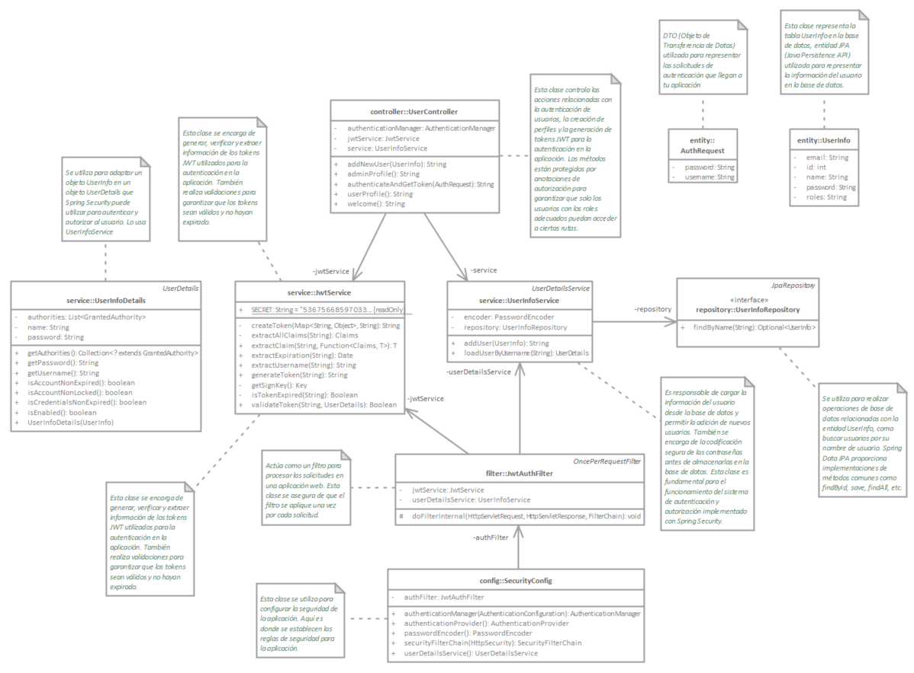

# Auth: Autenticacion con tokens JWT en Spring Boot con Spring Security

Este proyecto es una aplicación de ejemplo que utiliza Spring Boot y Spring Security para implementar autenticación y autorización en una aplicación web. La aplicación incluye puntos de acceso seguros, registro de usuarios y generación de tokens JWT para la autenticación.

## Características

- Registro de usuarios con roles (ROLE_USER, ROLE_ADMIN).
- Generación de tokens JWT para la autenticación.
- Acceso a puntos de acceso seguros basados en roles.
- Almacenamiento seguro de contraseñas en la base de datos.

## Tecnologías Utilizadas

- Spring Boot
- Spring Security
- Spring Data JPA
- JWT (JSON Web Tokens)
- PostgreSQL (base de datos)
- Docker Compose (para la base de datos PostgreSQL)

## Requisitos

- Java Development Kit (JDK) 8 o superior
- Apache Maven (para compilar y administrar el proyecto)
- Un entorno de desarrollo Java (como IntelliJ IDEA o Eclipse)
- Docker (para PostgreSQL a través de Docker Compose)

## Configuración

1. Clona este repositorio en tu máquina local:

   ```bash
   git clone https://github.com/tuusuario/mi-proyecto-spring-security.git
   ```  

2. Abre el proyecto en tu entorno de desarrollo.

3. Configura tu entorno de desarrollo para utilizar Java 8 o superior.

4. Compila el proyecto con Maven:

   ```bash
   mvn clean install
    ```
5. Ejecuta el proyecto con Maven:
   
   ```bash
   mvn spring-boot:run
   ```
6. Abre tu navegador web y accede a la URL http://localhost:8080

# Configuración de la Base de Datos PostgreSQL con Docker Compose
   Asegúrate de tener Docker instalado en tu sistema.

   En la raíz del proyecto, ejecuta el siguiente comando para crear y ejecutar el contenedor de PostgreSQL:
    
    ```bash 
    docker-compose up -d
    ```
   Esto levantará una instancia de PostgreSQL con los datos de usuario y base de datos configurados en el archivo docker-compose.yaml.

# Diagrama del proyecto



## Uso
   Para registrarte como nuevo usuario, visita el punto de acceso /auth/addNewUser usando una solicitud POST y proporciona los detalles del usuario en el cuerpo de la solicitud.

   Para autenticarte y obtener un token JWT, visita el punto de acceso /auth/generateToken usando una solicitud POST y proporciona las credenciales de usuario.

   Accede a los puntos de acceso seguros como /auth/user/userProfile o /auth/admin/adminProfile incluyendo el token JWT en la cabecera de autorización.

## Contribución
   Si deseas contribuir a este proyecto, no dudes en crear un pull request, tu ayuda es muy apreciada.

## Licencia
   Este proyecto está bajo la Licencia MIT. Consulta el archivo [LICENSE](LICENSE) para obtener más detalles.